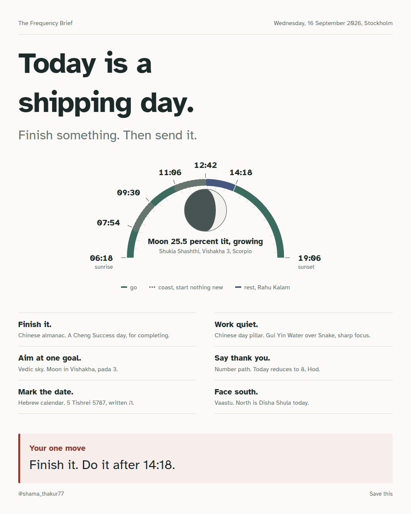
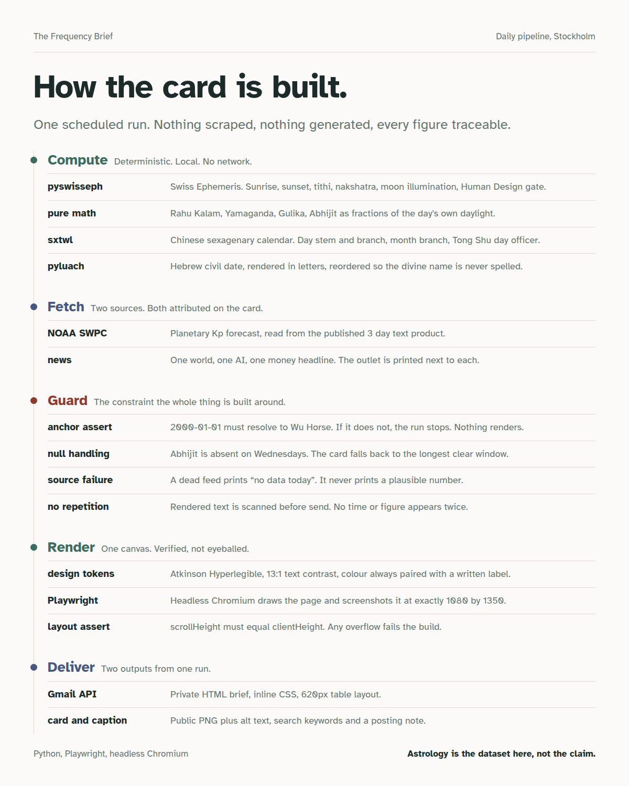

# The Frequency Brief

**A daily card that tells you when to do the hard thing.**

One card a day. Every number on it is worked out, not guessed.



---

## The problem

<!-- Rewrite this paragraph in your own words before anyone reads it. -->

I wanted one answer each morning: when is the good stretch to do focused work,
and when should I leave it alone. Getting that answer meant checking several
different places, and they did not agree.

Asking an AI made it worse. It produced times that looked right and were wrong,
and nothing in the answer told me which was which.

## Why I built it

I do this for a living. My day job is data quality and compliance monitoring,
where a number that looks plausible but is unverified is the worst kind of
number, because people act on it.

So I built the morning answer the way I would build anything at work: compute
it, prove it, and make it fail loudly when it cannot.

## What it solves

- **One place instead of four.** All six systems on a single card.
- **No invented numbers.** Every figure is either calculated on my own machine
  or printed next to the source it came from.
- **It admits when it doesn't know.** A missing window is printed as missing. A
  dead data feed prints `no data today`.
- **Readable at 7am.** Built to a low-stimulation design system so it can be
  understood in a glance, not studied.

## What you get

Two outputs from one scheduled run:

1. A private HTML email with the full day, sent before you wake up.
2. A public PNG card, plus alt text and caption, ready to post.

Times are computed for Stockholm. Any city works, you change one setting.

## How to use it

```bash
git clone https://github.com/shamathakur77/frequency-brief.git
cd frequency-brief

pip install -r requirements.txt
npm install
npx playwright install chromium

# inline the webfont as base64 so rendering never waits on a network call
python3 tools/build_fonts.py

python3 -m frequency_brief            # today, Stockholm
node frequency_brief/screenshot_card.js
```

The card lands at `out/card.png` at exactly 1080 x 1350.

Other days and places, and the computed values on their own:

```bash
python3 -m frequency_brief --date 2026-12-21
python3 -m frequency_brief --location nashik      # or pune
python3 -m frequency_brief --offline              # skip the fetched sources
python3 -m frequency_brief --json                 # print the day, render nothing
```

A GitHub Actions workflow in `.github/workflows/daily.yml` runs the whole thing
every morning at 05:10 UTC and commits the new card to `docs/card.png`, so the
image at the top of this README is always the current day.

---

## How it works



**Six systems, all computed locally**

| System | Library | What it gives |
| --- | --- | --- |
| Astronomy | `pyswisseph` (Swiss Ephemeris) | Sunrise, sunset, tithi, nakshatra, lunar illumination, Human Design sun gate |
| Vedic day windows | plain arithmetic | Rahu Kalam, Yamaganda, Gulika, Abhijit, each a fixed fraction of that date's own daylight |
| Chinese calendar | `sxtwl` | Day stem and branch, month branch, Tong Shu day officer |
| Hebrew calendar | `pyluach` | Civil date rendered in letters, reordered so the divine name is never spelled |
| Number path | plain arithmetic | Date digits reduced to one figure |
| Vaastu | lookup by weekday | Disha Shula, expressed as a direction to face |

Because the Vedic windows are fractions of daylight, their length changes with
the season. Rahu Kalam runs about 46 minutes in December and about 140 in June
at 59°N. That is the geometry, not a bug.

**Two fetched sources, both attributed on the card**

- NOAA Space Weather Prediction Center, 3 day planetary Kp forecast.
- Three headlines: one world, one AI, one markets. The outlet is printed beside
  each headline.

**Four guards that gate the render**

| Guard | Behaviour |
| --- | --- |
| Anchor assertion | `2000-01-01` must resolve to a Wu Horse day pillar, or the run raises and nothing renders |
| Null handling | The Abhijit window does not exist on Wednesdays. The card falls back to the longest clear stretch and relabels it |
| Source failure | A dead feed prints `no data today` rather than a plausible substitute |
| No repetition | Rendered text is diffed before send, so no time or figure appears twice |
| Rounded first | Sunrise and sunset are rounded to the minute *before* the eight day-parts are cut from them, so every printed boundary adds back up to the printed sunset |

**Render**

Playwright drives headless Chromium and screenshots the page at exactly
1080 x 1350. Layout is asserted, not eyeballed: `scrollHeight` must equal
`clientHeight`, so any overflow fails the build instead of clipping silently.

## Design

Built on a low-stimulation design system for AuDHD readers, which turns out to
read better for anyone at 7am:

- One typeface. Atkinson Hyperlegible, drawn by the Braille Institute so no two
  letterforms can be confused.
- Text contrast at 13:1, well past WCAG AAA.
- No colour-only encoding. Every band on the day dial carries a written label.
- No gradients, no shadows. Hairlines and vertical rhythm carry the structure.
- One accent colour, used once, on the single action for the day.

## Tech stack

`Python 3` · `pyswisseph` · `sxtwl` · `pyluach` · `Playwright` ·
`headless Chromium` · `Gmail API` · `HTML` · `CSS` · `SVG`

## Skills this exercises

Deterministic data pipelines · third-party API integration · data validation and
assertion design · graceful degradation and null handling · scheduled and
unattended jobs · SVG data visualisation · accessible design systems and WCAG
contrast · HTML email that survives real clients · technical writing

## Repo layout

```
frequency_brief/
  day.py                   one date and place -> every value the card needs
  frameworks.py            the five calendar systems, all deterministic
  copy.py                  wording tables: values in, plain sentences out
  render.py                the card, QUIET design tokens
  sources.py               NOAA Kp and optional headlines, both fail to None
  __main__.py              the CLI
  build_arch.py            the pipeline diagram
  screenshot_card.js       Playwright render plus the layout assertion
  screenshot_pipeline.js   Playwright render, 1200x1500
tools/
  build_fonts.py           inline the webfont as base64
.github/workflows/
  daily.yml                the scheduled run
docs/                      rendered images used in this README
```

Nothing in `day.py` reaches the network, so `--offline` is fully reproducible:
the same date and place always produce the same card.

## A note on what this is

The card reads six traditions that were built independently of each other, in
different centuries, on different continents. When several of them land on the
same instruction for a given date, that is a coincidence worth noticing. It is
not evidence of anything, and the card never claims it is.

Astrology is the dataset here. It is not the claim.

## Licence

MIT.
